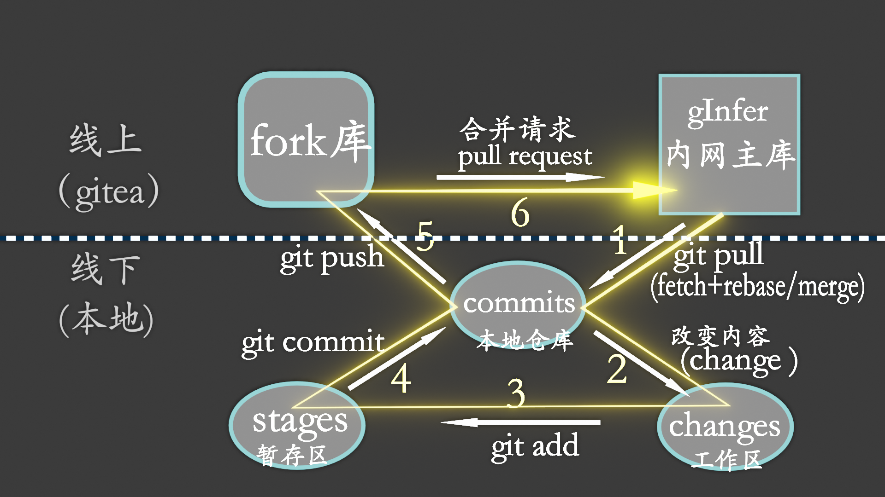

ginfer的开发使用git和gitea进行多人协作和版本管理

# git 基础
## git是版本控制系统（VCS）

>版本控制是指记录一段时间内对一个文件或一组文件的更改的系统，称为“版本”。换句话说，这些版本将帮助您跟踪代码/项目中的更改，如果需要，还可以撤消这些更改。
>当处理较大的项目时，这种能够比较、区分和还原特定项目的两个版本之间的更改的功能变得非常有用。较大的项目意味着更多的人使用相同的代码工作，这增加了冲突的机会。使用版本控制，您可以轻松防止这些冲突。

## gitea

gitea类似github
是一个基于Web的Git版本控制存储库托管服务。它提供了Git的所有分布式版本控制和源代码管理（SCM）功能，并提供了一些自己的特性。对于开发人员而言，这是他们可以在其中存储项目并与志趣相投的人建立联系的地方。您可以将其视为“代码云”。
## git 和gitea的区别

| git           | gitea            |
| ------------- | ---------------- |
| 一个安装在本地的软件    | 托管在web上的服务       |
| 命令行           | 图形界面             |
| 管理git存储库的文件版本 | 是一个上传git存储库副本的空间 |


## git的相关基本概念
**远程仓库是指我们代码存储在服务器的地方**
1. 克隆：
从远程仓库克隆到本地的过程
本地仓库指的是我们开发人员从远程仓库克隆一份代码之后，保存在我们本地的代码，这份代码只有克隆的代码的开发人员可以看到。
2. 分支：
我们在开发中可能会遇到多个分支进行，比如主分支(master分支)，开发分支(develop分支)，但我们开发的时候，一般不在master上面进行开发，而是我们自己单独的从主分支或者开发分支中在分出来一条分支(比如test分支)，然后我们就在test分支上进行开发，每个分支都有自己的代码。
3. 提交：
在我们的代码开发完成之后，需要将代码进行提交，提交的时候需要我们将修改的文件进行提交，并说明修改的内容。注意，此时代码提交只会提交到我们本地的仓库，远程仓库此时还不会修改。
4. 拉取：
开发中，同一个项目可能是多人协作开发，这个时候，我们就需要将别人修改的代码拉去下来合并到我们自己的代码中。但是如果不同的开发人员修改了统一部分代码，那么就可能发冲突，这时候我们需要解决完冲突时候，才能继续将代码进行提交。
5. 合并：
在上面我们自己的分支开发完成之后，没有问题之后，需要将我们的分支合并到主分支上面
6. 推送：
之前的所有操作都是在我们本地进行的，远程仓库的代码并没有任何的改变，这个时候就需要我们将本地的代码推送到远程的仓库中，更新远程仓库代码。在推送的过程中，如果我们本地的代码不是最新版本的，就需要我们先将远程代码拉去下来(如果有冲突重新解决冲突，提交)，然后在重新推送。

在开发中，我们可以合理地使用Git进行管理，当新版本遇到问题之后，我们就可能需要将代码进行回滚，使用旧版本的代码，这样可以很方便的解决突发问题。

[原文链接](https://blog.csdn.net/weixin_51170516/article/details/111187007)
# gInfer 代码管理的流程

为了保证代码的质量，协作开发人员先在派生库中提交，随后再向主库提交合并请求，由主库管理员审核代码后进行合并。具体流程如下：
## 流程分解
### 初始化工程

![[gInfer_git_fork.png]]
1. 在gitea上将ginfer库进行派生（fork）得到fork库
2. 复制fork库git地址 xxx.git
3. 建好本地文件夹并打开控制台输入
```git
git clone xxx.git
```

4. 完毕
### 本地工作
![[gInfer_git_commit.png]]
1. 在工作区改动内容
2. 将改动的内容添加到暂存区
```git
git add .   # 添加当前目录下的所有变更
git add filename
```
		1. 将暂存区的内容进行提交 本地仓库
```git
git commit -m 'commit msg'
```

### 推向远端仓库

![[gInfer_git_push.png]]
1. 通常在推送前先进行pull，确保融合了最新的内容，防止冲突
2. 将本地的内容同步到远端仓库
3. 在gitea上向主库发送合并请求

#### 一、pull

1、pull默认等于 fetch+merge
通常，pull（或fetch）是默认从fork库拉下代码的，因为初始化时，是从fork库clone下来的。
所以，需要更改当前分支所对应的远端分支。
git remote
```git
# Git查看远程仓库地址
git remote -v

# Git添加远程仓库
git remote add [远程仓库别名] <远程仓库URL>
git remote add upstream wks_GInferxxx.git
```
git fetch
此时可以用git fetch去拉主库的代码
```git
git fetch upstream master # 通常master处可能是类似202405dev这样的分支
git fetch upstream # 或者不指定分支，直接下载整个仓库
git fetch upstream 202405dev:localBranch # 把主仓库的202405dev分支下载到本地，并建立localBranch分支 
```

git merge
把本地和远端仓库，或者本地的各个分支间进行合并。
git merge 是传统的合并方式，能够保留所有的提交记录，缺点是记录太多、太乱。
考虑用git merge squash 合并掉冗余的提交

2、在实际使用中，如果是新功能分支的开发，建议使用 fetch+ rebase

> [!warning] rebase （变基） 使用注意事项
> 不要在主干中去rebase分支，要在分支中去rebase主干，除非你知道自己在干什么，否则可能会很乱。此处的分支指末端分支，比如一个新功能分支或一个bug修复分支。
> ```git
> git rebase featureBranch # no no no
> git rebase master    # yes 
>```

3、通常，建议用以下内容代替pull
```git 
# 如果还没有upstream 添加upstream 当然可以用别的名字 
git remote add upstream wks_GInferxxx.git
# 更新远端代码至本地，注意，此时并没有改变工作区的内容
git fetch upstream
# 和本地代码进行合并
git rebase upstream/202405dev # 在本地分支中执行，以远端分支为基
```
#### 二、push
git push 会将本地仓库同步至远端仓库，此处的远端仓库为fork库 通常为origin
```git
git push origin devxxx
git push origin loaclBranch:remoteBranch # 指定对应的分支
```
#### 三、pull request （合并请求）
在web端操作，本方案用的是gitea，因此在getea上创建合并请求
## 流程概括
### 初次
1 在gitea的主库上fork出一个自己的库 假设库的git地址为xxx.git
2 在本地建好文件夹作为本地仓库，在控制台进入该文件夹并执行
```git
git clone xxx.git
```
3 设置好远端仓库 此处远端仓库为主库 假设主库git地址为wks.git
```git
git remote add upstream wks.git
```
### 推荐的工作流程

1 新建分支
```git
git fetch upstream 202405dev:newFeatureBranch // 新建分支newFeatureBranch，并让其跟踪主库upstream的主开发分支202405dev
git checkout newFeatureBranch //跳转到新建的分支
```
2 在工作区更改代码
3 将更改添加到暂存区
```git 
# 暂存某个文件的变更
git add filename
#或者 将当前目录下的所有变更全部暂存
git add .
```
4 将暂存区内容提交
```git 
git commit -m 'commit msg 提交注释'
```
4-1 主库代码可能已经更新了，需要将更新同步至本地
```git
git fetch upstream
git rebase upstream/202405dev
```
5将本地代码推向fork库 通常名为origin
```git
git push origin newFeatureBranch
```
6 在gitea上向主库提出合并请求，等待审批。如果有冲突则全部撤回。no conflict .
# 常用命令

| git 命令                    | 说明                                 |
| ------------------------- | ---------------------------------- |
| git commit -m 提交信息        | 向仓库中提交代码                           |
| git log                   | 查看提交记录                             |
| git add 文件列表              | 追踪文件，文件存入暂存区                       |
| git checkout 文件名          | 用暂存区中的文件覆盖工作目录中的文件                 |
| git reset --hard commitID | 将 git 仓库中指定的更新记录恢复出来，并且覆盖暂存区和工作目录  |
| git branch                | 查看分支                               |
| git branch 分支名称           | 创建分支                               |
| git checkout 分支名称         | 切换分支                               |
| git merge 来源分支            | 合并分支，尽量在主分支上去合并功能分支或者修复分支          |
| git rebase 基分支            | 变基，也是合并分支，尽量在新功能分支或修复分支去以主分支为基进行变基 |
| git branch -d 分支名称        | 删除分支（分支被合并后才允许删除）（-D 强制删除）         |


# 常见问题及解决方案

### 1、提交了过多的commit 导致冗余
==方案一：git rebase -i==
此方案可以重新整理commits
git rebase -i upstream/2020405dev
在弹出的文本编辑器中进行编辑


> [!NOTE] vim 的常用操作
> 按 I键进入编辑（插入）模式，可对文本进行编辑
编辑完后 按ESC键 退出编辑模式
按:冒号键进入命令行
输入 wq 即为保存退出
不想保存请用q
不让退出可以用q!强制退出

把每行的首个pick进行更改 具体可看编辑器内的注释
把不需要的commit 删除
把多个完成一个功能的commit进行合并 pick改为s 或 f 具体看注释

方案二：git merge --squash
切换到你想要push的分支，或者主分支，把功能分支merge进来 squash参数会把许多commits压缩了

### 2、修改提交过的Commit
==此处提交过是指在本地的提交，如果某个commit已经合入主库，则不要修改它，如果非要修改会导致很多麻烦。==


**1，修改最近一次commit的信息  **

```git
git commit --amend
```
使用命令：git commit --amend,进入命令模式，这是按 a或者i或者o进入编辑模式，我们修改好commit信息后按Esc健退出编辑模式，然后:wq保存我们编辑的信息。
最后git push到远程仓库

**2，修改最近两个或者两次上的commit信息**

使用命令：==git rebase -i commitID==
```git
git rebase -i commitID
```
进入编辑模式后把要修改的commit对应的==pick改成e或者edit==。退出保存。

这时会提示你
stop在 哪个commit那儿
可以使用git commit --amend去修改，改好之后用git rebase --continue完成

开始修改---

> [!NOTE]  eg：撤销commit中单个文件的修改
> 例如之前误改了某个文件，此时可以用 git reset 来还原出一个没误改的文件
> 

```git
git reset <commit-id> <fileName> # 此命令执行完后会把你想要的文件放入stage，同时在工作区保留了这两个commit之间的改动（就是误改的部分）
git checkout <fileName> 把误改的变更撤销
```
改完---
```
git add . # 上述的例如情况不需要git add
git commit --amend
git rebase --continue
```


